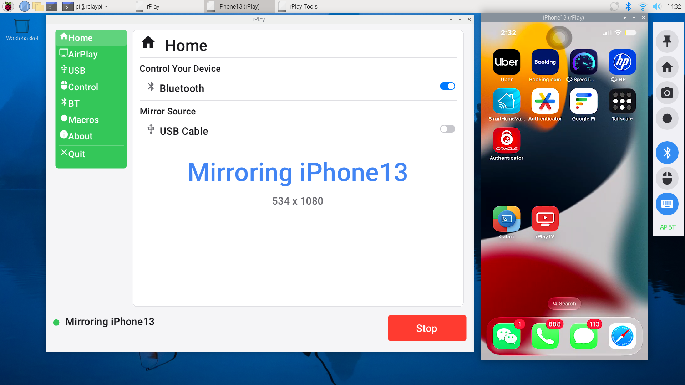
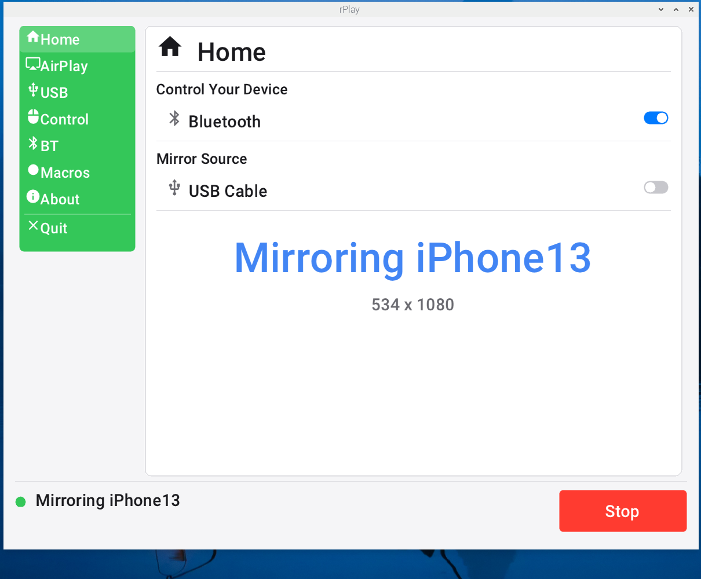
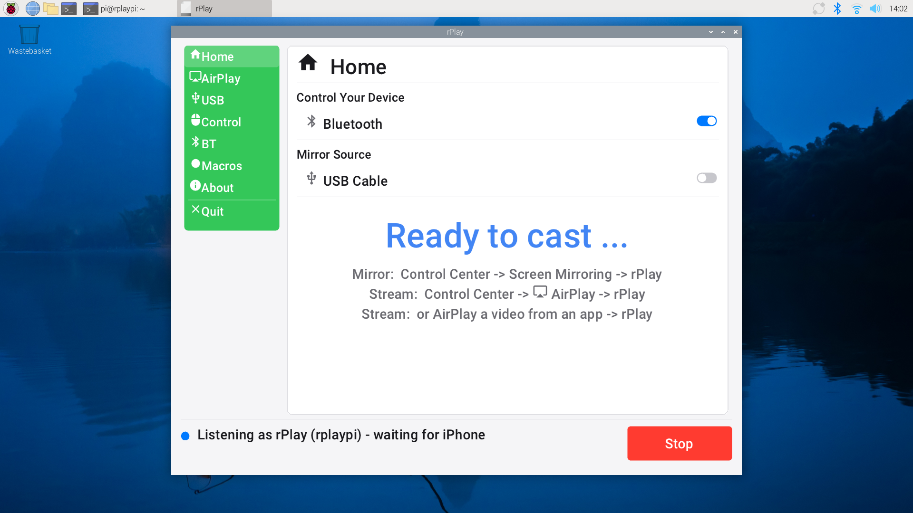

# rPlay for Linux and Raspberry Pi

rPlay turns a Linux machine into an **AirPlay 2 receiver**: an iPhone or iPad
mirrors its screen to it over Wi-Fi, video flung from apps such as YouTube
plays back natively, and you can **drive the phone from the machine's mouse
and keyboard**. It also mirrors over a plain **USB cable**, with no network at
all.

### ⬇ Download

**[rplay_0.4.1_arm64.deb](https://github.com/rPlayAI/rplay-linux/releases/latest)** — Raspberry Pi OS Bookworm, 64-bit

```sh
sudo apt-get install -y ./rplay_0.4.1_arm64.deb
/opt/rplay/bin/rplay
```

Click **Start**, then pick rPlay from Control Centre → Screen Mirroring.

📖 **[Complete Raspberry Pi guide](docs/raspberry-pi.md)** — start here ·
[Report a problem](https://github.com/rPlayAI/rplay-linux/issues)

This repository is for **releases, documentation and issues**. The source code
is not public.

## Raspberry Pi

Built and running natively on **Raspberry Pi OS Bookworm (64-bit)**, verified
on a Raspberry Pi 4 Model B.



*The whole Pi desktop: the rPlay window, the live iPhone mirror at 534×1080,
and the tool rail for pin, home, screenshot, record and input.*



*The receiver window on its own.*



*Idle, advertising itself over Bonjour as an AirPlay receiver.*

## Latency

Measured on a Raspberry Pi 4 Model B with an iPhone 12, software decoding,
stopwatch against a running timer on the phone:

| | AirPlay (Wi-Fi) | USB cable |
|---|---|---|
| **Latency** | **40–60 ms** | ~480 ms |
| Frame rate | 30–49 fps | 19 fps |
| CPU | ~1 core of 4 | ~1.4 cores of 4 |
| Resolution | 534×1080 | 888×1920 |

40–60 ms over Wi-Fi is low enough that scrolling and typing feel attached to
the mouse rather than lagging behind it.

**On a Pi, use AirPlay rather than USB.** USB delivers a near-native
888×1920 stream — 2.9× the pixels — and a Cortex-A72 cannot software-decode
that in time; the shortfall shows up as latency. The same code does USB
mirroring at 50 ms on an x86 PC.

## What works today

- **AirPlay 2 screen mirroring** from iPhone and iPad
- **Video streaming** from apps (YouTube and similar), decoded on the Pi —
  including ad breaks, seeking and autoplay to the next video
- **AirPlay audio**, with or without video
- **Controlling the phone** — mouse, keyboard and touch forwarded over
  Apple's iAP protocol across a Bluetooth RFCOMM link. Needs the phone paired,
  a reachable MFi control-license server, and Accessibility → Zoom (or
  AssistiveTouch) switched on. See the [guide](docs/raspberry-pi.md#5-controlling-the-phone).
- **USB-cable mirroring** through a separate `rplay_wd` daemon, so a crash
  there cannot take the receiver down
- **Bonjour** advertising through Apple's own mDNSResponder
- **Headless operation** — `--autostart`, `--usb-mirror`, `--no-host-prepare`
  for a boot script

## Built on the Pi from

| Component | Version |
|---|---|
| Raspberry Pi OS | Bookworm, 64-bit |
| FFmpeg | **5.1** (`libavcodec 59.37.100`), aarch64 with NEON |
| SDL2 | 2.0.22, X11 and KMSDRM |
| OpenSSL | 1.1.1w |
| fdk-aac | 2.0.2 |
| libimobiledevice / libusb | for USB mirroring |
| Bonjour | Apple mDNSResponder |

A full native build takes roughly 100 minutes on a Pi 4, most of it FFmpeg.
The result is packaged as an `arm64` `.deb`.

## Known issues

- **Hardware H.264 decode does not work.** The Pi's `h264_v4l2m2m` decoder
  runs but manages ~2.6 fps against 19 for software decode, and saves no
  measurable CPU. Leave `RPLAY_H264_DECODER` unset. This is the main thing
  being worked on — software decode is what the numbers above are.
- **USB mirroring is slow on a Pi** (~480 ms), for the reason above.
- **Occasional brief hiccup** — a ~400 ms stall turns up roughly once every
  few minutes in some sessions and not at all in others. Cause not yet
  identified.
- **Rapid video switching in some apps** can leave the phone's transport
  controls out of step — a Play button while the video plays. Tapping resyncs
  it. Apps that insert several queue items at once (iQiyi) can also land on a
  different item than the one picked.
- **First USB pairing needs a replug**, and reconnecting after an unplug can
  leave the mirror dead.

Pi 5 has no hardware H.264 decoder and is untested. Pi 3 is untested and is
likely short of both CPU and memory.

## Reporting a problem

Open an issue and include:

1. Pi model and RAM, and the output of `cat /etc/os-release`
2. iPhone or iPad model and iOS version
3. What you did and what happened
4. The receiver log: `/opt/rplay/bin/rplay 2>&1 | tee /tmp/rplay.log`
5. `/opt/rplay/bin/usb-host-services.sh status`

## Status

Early, and published for a first round of testing. Mirroring, audio, control,
video fling and USB all work on a Pi 4; the frame rate under software decode
is the main thing being improved.
